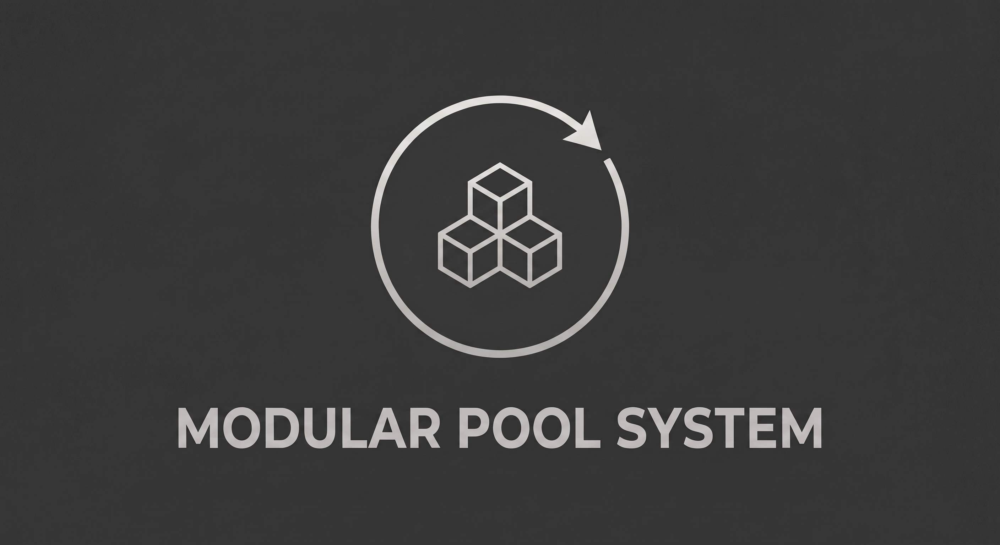
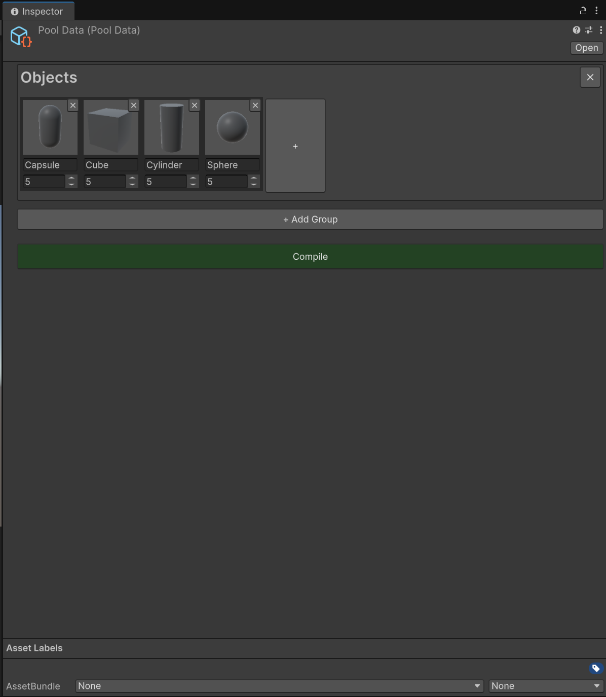
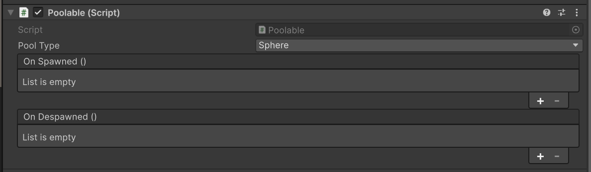

# PoolSystem

Generic object pooling system for Unity.



## Overview

PoolSystem is a Unity object pooling library built around a **pure C# core** (`GenericPool<T>`) with
zero UnityEngine dependency, plus a thin Unity adapter on top (`GameObjectPool`, `Poolable`,
`PoolManager`). Instead of registering pools by hand at runtime, you describe every pool visually in
a `PoolData` asset — grouped, named entries with a live 3D prefab preview — and a one-click **Compile**
step generates a strongly-typed `PoolTypes` enum and wires each prefab's `Poolable` component
automatically.

Pooling is a **component you attach, not a class you inherit from**: any script that needs a
spawn/despawn callback just implements the plain `IPoolable` interface directly, so it never competes
with another base class.

## Screenshots

| Pool Data editor | `Poolable` component |
| --- | --- |
|  |  |

## Features

- Pure C# pooling engine (`GenericPool<T>`) - allocation-free steady-state `Get()`/`Release()`, fully
  unit-testable outside Play Mode
- `Poolable` component: discovers and forwards to any sibling `IPoolable` scripts automatically, and
  exposes `OnSpawnedEvent`/`OnDespawnedEvent` `UnityEvent`s for no-code wiring
- Visual `PoolData` editor: named groups, a wrapping card grid per group with live prefab previews,
  drag-and-drop reassignment, and an inline Initialize Count stepper
- One-click **Compile**: generates a contiguous `PoolTypes` enum and assigns every prefab's `Poolable`
  component in a domain-reload-safe, two-phase process
- `PoolManager`: a minimal static API (`Initialize`, `Get`, `Release`) backed by a plain array indexed
  by `(int)PoolTypes` - no dictionary hashing, no boxing
- Double-release and foreign-object guards that log a warning instead of corrupting pool state
- Automatic pool cleanup on scene unload

## Setup

### Requirements

- Unity 2021.3 LTS or newer

### Installation

Clone or download this repository, then copy the `PoolSystem` folder into your project's
`Assets/Scripts/` (or anywhere under `Assets/`). It's self-contained via its own assembly
definitions - no other setup is required.

## Quick Start

**1. Make a script poolable** by implementing `IPoolable` directly (no base class needed):

```csharp
using UnityEngine;
using PoolSystem;

public class Enemy : MonoBehaviour, IPoolable
{
    public void OnSpawned()  { /* reset state */ }
    public void OnDespawned() { /* unsubscribe from events, stop coroutines */ }
}
```

**2. Create a Pool Data asset** via `Create > Pool System > Pool Data`, add a group, and drag your
prefab into it with a name (e.g. `Enemy`) and an initial spawn count.

**3. Click Compile.** Unity recompiles and assigns each prefab's `Poolable` component automatically.

**4. Initialize once, then spawn/release from anywhere:**

```csharp
using UnityEngine;
using PoolSystem;

public class Example : MonoBehaviour
{
    [SerializeField] private PoolData poolData;

    private void Awake() => PoolManager.Initialize(poolData);

    private void Start()
    {
        var instance = PoolManager.Get(PoolTypes.Enemy);
        instance.transform.position = transform.position;

        PoolManager.Release(PoolTypes.Enemy, instance);
    }
}
```

## License

[MIT License](LICENSE)
